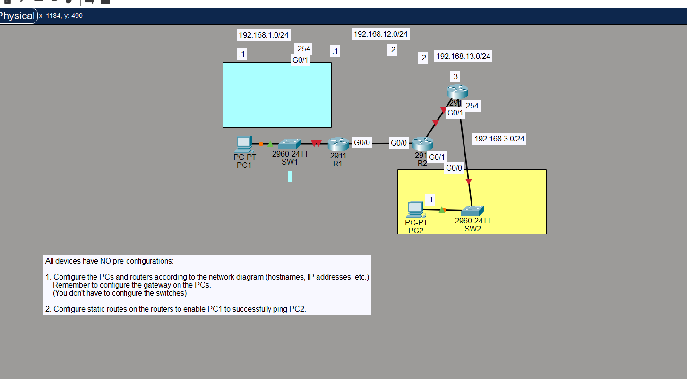
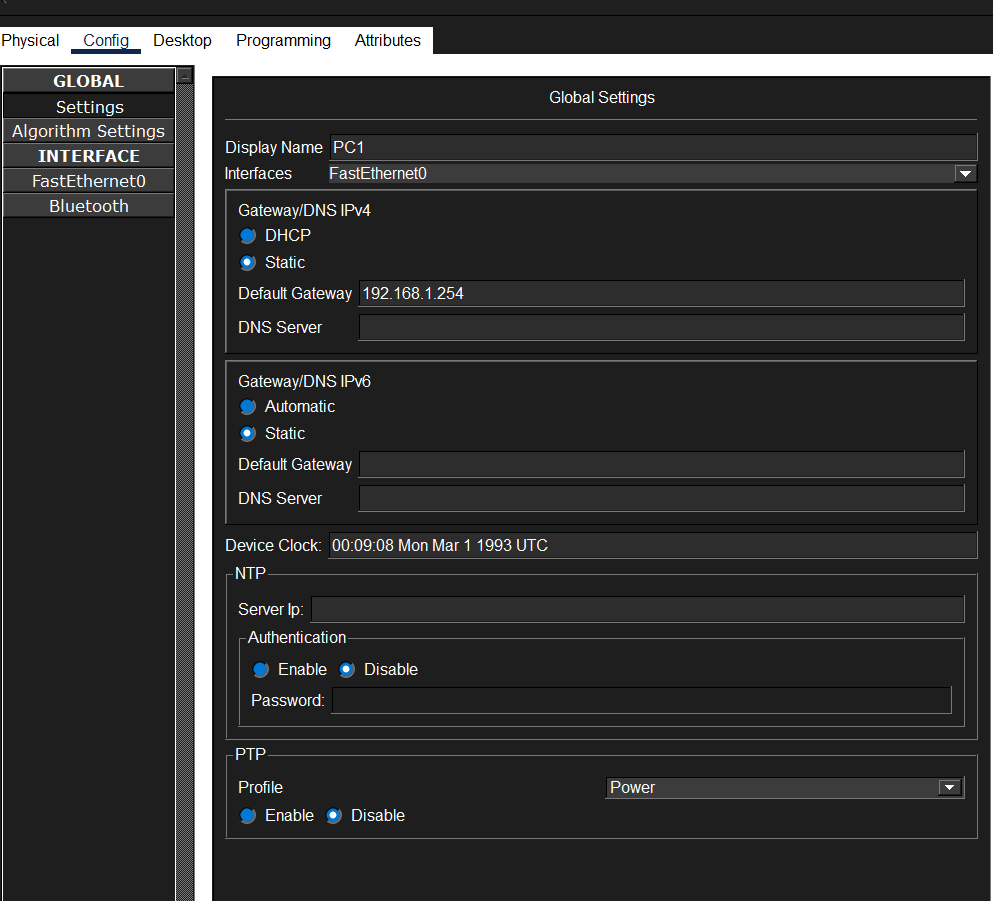
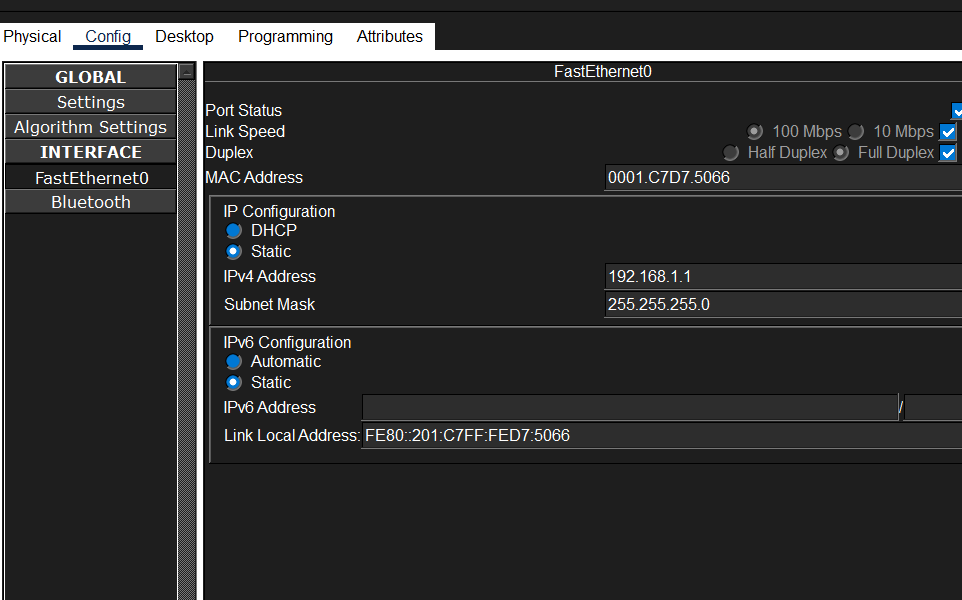
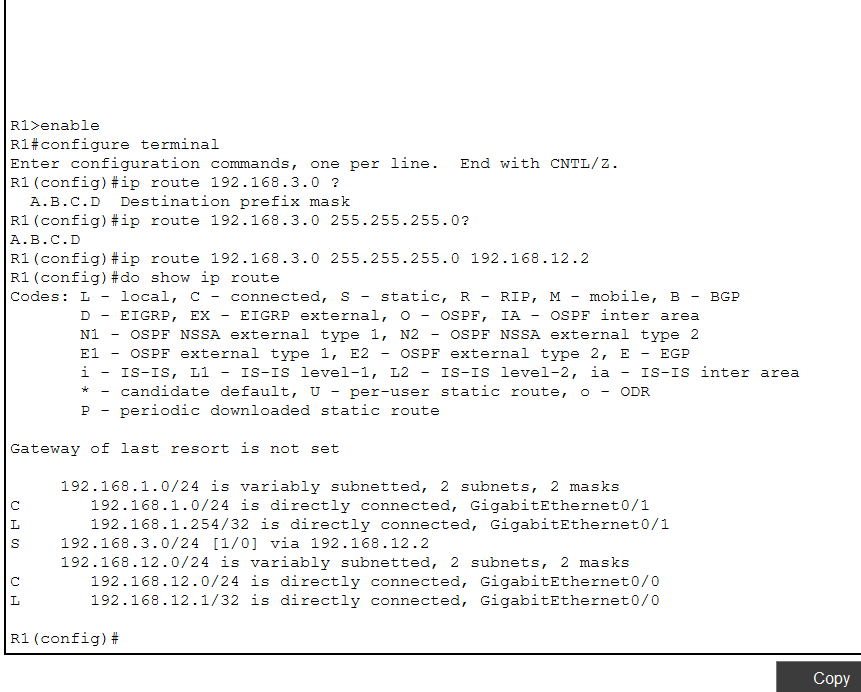
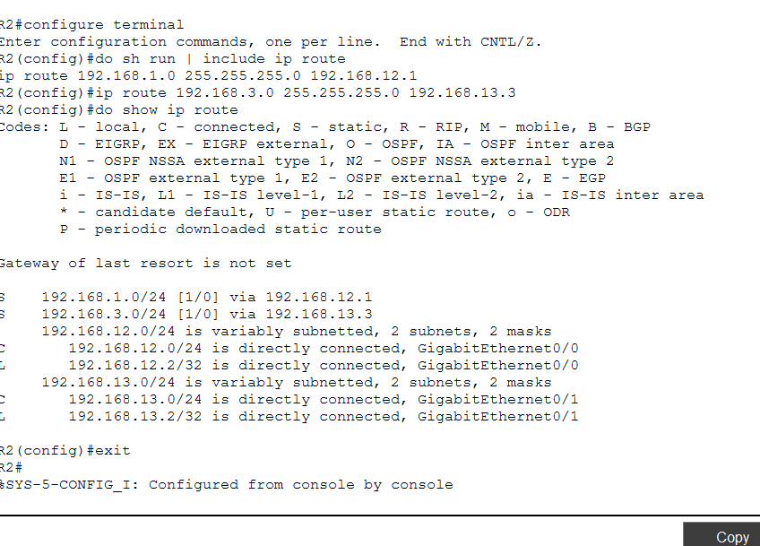

# Lab 11: Configuring Static Routes

## Lab Objective
Configure static routes on routers to enable PC1 (on network 192.168.1.0/24) to successfully communicate with PC2 (on network 192.168.3.0/24) through an intermediate router R2.

## Network Topology



## Part 1: Initial Device Configuration

### 1.1 Configure PC1
**Steps:**
1. Click PC1 → Config tab → Settings
2. Set IP Address: `192.168.1.1`
3. Set Subnet Mask: `255.255.255.0`
4. Set Default Gateway: `192.168.1.254` (R1's interface)




### 1.2 Configure PC2

1. Click PC2 → Config tab → Settings
2. Set IP Address: `192.168.3.1`
3. Set Subnet Mask: `255.255.255.0`
4. Set Default Gateway: `192.168.3.254` (R3's interface)

*(Same process as PC1, but with R3 as the gateway)*

### 1.3 Configure Router R1

```cisco
Router>enable
Router#configure terminal
Router(config)#hostname R1

! Configure interface to SW1
R1(config)#interface g0/1
R1(config-if)#ip address 192.168.1.254 255.255.255.0
R1(config-if)#description #to SW1#
R1(config-if)#no shutdown

! Configure interface to R2
R1(config-if)#interface g0/0
R1(config-if)#ip address 192.168.12.1 255.255.255.0
R1(config-if)#description #To R2#
R1(config-if)#no shutdown

! Verify configuration
R1(config-if)#do show ip interface brief
```

**Output:**
```
Interface              IP-Address      OK? Method Status                Protocol 
GigabitEthernet0/0     192.168.12.1    YES manual up                    up 
GigabitEthernet0/1     192.168.1.254   YES manual up                    up 
GigabitEthernet0/2     unassigned      YES unset  administratively down down 
Vlan1                  unassigned      YES unset  administratively down down
```

### 1.4 Configure Router R2

```cisco
Router>enable
Router#configure terminal
Router(config)#hostname R2

! Configure interface to R1
R2(config)#interface g0/0
R2(config-if)#ip address 192.168.12.2 255.255.255.0
R2(config-if)#description #To R1#
R2(config-if)#no shutdown

! Configure interface to R3
R2(config-if)#interface g0/1
R2(config-if)#ip address 192.168.13.2 255.255.255.0
R2(config-if)#description #To R3#
R2(config-if)#no shutdown
```

*(Configuration screenshot not captured during initial setup)*

### 1.5 Configure Router R3

```cisco
Router>enable
Router#configure terminal
Router(config)#hostname R3

! Configure interface to R2
R3(config)#interface g0/0
R3(config-if)#ip address 192.168.13.3 255.255.255.0
R3(config-if)#description #To R2#
R3(config-if)#no shutdown

! Configure interface to SW2
R3(config-if)#interface g0/1
R3(config-if)#ip address 192.168.3.254 255.255.255.0
R3(config-if)#description #to SW2#
R3(config-if)#no shutdown

! Verify configuration
R3(config-if)#do show ip interface brief
```

**Output:**
```
Interface              IP-Address      OK? Method Status                Protocol 
GigabitEthernet0/0     192.168.13.3    YES manual up                    up 
GigabitEthernet0/1     192.168.3.254   YES manual up                    up 
GigabitEthernet0/2     unassigned      YES unset  administratively down down 
Vlan1                  unassigned      YES unset  administratively down down
```


## Part 2: Configuring Static Routes

### 2.1 Static Route Requirements

**Route Analysis:**
- **R1** needs a route to reach 192.168.3.0/24 (PC2's network) via R2
- **R2** needs routes to reach both:
  - 192.168.1.0/24 (PC1's network) via R1
  - 192.168.3.0/24 (PC2's network) via R3
- **R3** needs a route to reach 192.168.1.0/24 (PC1's network) via R2

**Total routes needed: 4 static routes**

### 2.2 Configure Static Route on R1

```cisco
R1>enable
R1#configure terminal

! Add static route to PC2's network
R1(config)#ip route 192.168.3.0 255.255.255.0 192.168.12.2

! Verify the route was added
R1(config)#do show ip route
```

**Routing Table Output:**
```
Gateway of last resort is not set

     192.168.1.0/24 is variably subnetted, 2 subnets, 2 masks
C       192.168.1.0/24 is directly connected, GigabitEthernet0/1
L       192.168.1.254/32 is directly connected, GigabitEthernet0/1
S    192.168.3.0/24 [1/0] via 192.168.12.2
     192.168.12.0/24 is variably subnetted, 2 subnets, 2 masks
C       192.168.12.0/24 is directly connected, GigabitEthernet0/0
L       192.168.12.1/32 is directly connected, GigabitEthernet0/0
```

**Key observations:**
- `S` = Static route
- `C` = Connected network
- `L` = Local interface address



### 2.3 Configure Static Routes on R2 (Initial Attempt - INCORRECT)

```cisco
R2>enable
R2#configure terminal

! INCORRECT: Using interface instead of next-hop IP
R2(config)#ip route 192.168.1.0 255.255.255.0 g0/0
R2(config)#ip route 182.168.3.0 255.255.255.0 g0/1  ! Also typed wrong IP!
```

**Problem:** This configuration used the exit interface method without specifying next-hop IPs, and contained a typo (182.168.3.0 instead of 192.168.3.0).


### 2.4 Configure Static Route on R3

```cisco
R3>enable
R3#configure terminal

! Add static route to PC1's network
R3(config)#ip route 192.168.1.0 255.255.255.0 192.168.13.2

! Verify the route
R3(config)#do show ip route
```

**Routing Table Output:**
```
Gateway of last resort is not set

S    192.168.1.0/24 [1/0] via 192.168.13.2
     192.168.3.0/24 is variably subnetted, 2 subnets, 2 masks
C       192.168.3.0/24 is directly connected, GigabitEthernet0/1
L       192.168.3.254/32 is directly connected, GigabitEthernet0/1
     192.168.13.0/24 is variably subnetted, 2 subnets, 2 masks
C       192.168.13.0/24 is directly connected, GigabitEthernet0/0
L       192.168.13.3/32 is directly connected, GigabitEthernet0/0
```

---

## Part 3: Testing and Troubleshooting

### 3.1 Initial Ping Test - FAILED

**Test from PC1 to PC2:**
```
C:\>ping 192.168.3.1
```

**Result:** ❌ Ping failed


### 3.2 Troubleshooting Process

**Step 1: Verify PC1 Configuration**
```
C:\>ipconfig

FastEthernet0 Connection:(default port)
   IPv4 Address....................: 192.168.1.1
   Subnet Mask.....................: 255.255.255.0
   Default Gateway.................: 192.168.1.254
```

**Test connectivity to default gateway:**
```
C:\>ping 192.168.1.254

Pinging 192.168.1.254 with 32 bytes of data:
Reply from 192.168.1.254: bytes=32 time<1ms TTL=255
Reply from 192.168.1.254: bytes=32 time<1ms TTL=255
Reply from 192.168.1.254: bytes=32 time<1ms TTL=255
Reply from 192.168.1.254: bytes=32 time<1ms TTL=255

Ping statistics for 192.168.1.254:
    Packets: Sent = 4, Received = 4, Lost = 0 (0% loss)
```

✅ **PC1 configuration is correct** - Can reach its default gateway

**Step 2: Verify R1 Configuration**
```
R1>enable
R1#show ip interface brief
R1#show ip route
```

✅ **R1 configuration is correct** - Has proper route to 192.168.3.0/24

**Step 3: Verify R2 Configuration - PROBLEM FOUND**

```
R2>enable
R2#show ip interface brief
R2#show ip route
```

**Routing table showed:**
```
     182.168.0.0/24 is subnetted, 1 subnets
S       182.168.3.0/24 is directly connected, GigabitEthernet0/1  ! WRONG IP
                       [1/0] via 192.168.13.3
S    192.168.1.0/24 is directly connected, GigabitEthernet0/0
                    [1/0] via 192.168.12.1
```

**Issues identified:**
1. ❌ Typo: `182.168.3.0` instead of `192.168.3.0`
2. ❌ Mixed configuration: Both interface-based and next-hop IP routes exist
3. ❌ Duplicate/conflicting routes

### 3.3 Fixing R2 Configuration

**Check existing routes:**
```cisco
R2#configure terminal
R2(config)#do sh run | include ip route
ip route 192.168.1.0 255.255.255.0 GigabitEthernet0/0 
ip route 182.168.3.0 255.255.255.0 GigabitEthernet0/1 
ip route 182.168.3.0 255.255.255.0 192.168.13.3 
ip route 192.168.1.0 255.255.255.0 192.168.12.1 
```

**Remove ALL incorrect routes:**
```cisco
! Remove incorrect routes one by one
R2(config)#no ip route 182.168.3.0 255.255.255.0 192.168.13.3
R2(config)#no ip route 182.168.3.0 255.255.255.0 GigabitEthernet0/1
R2(config)#no ip route 192.168.1.0 255.255.255.0 GigabitEthernet0/0

! Verify all routes are removed
R2(config)#do sh run | include ip route
(should show nothing)
```

**Add CORRECT routes with proper next-hop IPs:**
```cisco
! Route to PC1's network via R1
R2(config)#ip route 192.168.1.0 255.255.255.0 192.168.12.1

! Route to PC2's network via R3
R2(config)#ip route 192.168.3.0 255.255.255.0 192.168.13.3

! Verify corrected routing table
R2(config)#do show ip route
```

**Corrected Routing Table:**
```
Gateway of last resort is not set

S    192.168.1.0/24 [1/0] via 192.168.12.1
S    192.168.3.0/24 [1/0] via 192.168.13.3
     192.168.12.0/24 is variably subnetted, 2 subnets, 2 masks
C       192.168.12.0/24 is directly connected, GigabitEthernet0/0
L       192.168.12.2/32 is directly connected, GigabitEthernet0/0
     192.168.13.0/24 is variably subnetted, 2 subnets, 2 masks
C       192.168.13.0/24 is directly connected, GigabitEthernet0/1
L       192.168.13.2/32 is directly connected, GigabitEthernet0/1
```

✅ **Routes are now correct**



---

## Part 4: Final Verification

### 4.1 Successful Ping Test

**Test from PC1 to PC2:**
```
C:\>ping 192.168.3.1

Pinging 192.168.3.1 with 32 bytes of data:
Reply from 192.168.3.1: bytes=32 time<1ms TTL=126
Reply from 192.168.3.1: bytes=32 time<1ms TTL=126
Reply from 192.168.3.1: bytes=32 time<1ms TTL=126
Reply from 192.168.3.1: bytes=32 time<1ms TTL=126

Ping statistics for 192.168.3.1:
    Packets: Sent = 4, Received = 4, Lost = 0 (0% loss)
Approximate round trip times in milli-seconds:
    Minimum = 0ms, Maximum = 0ms, Average = 0ms
```

✅ **SUCCESS!** PC1 can now reach PC2

**Note:** TTL=126 indicates the packet passed through 2 routers (started at 128, decreased by 1 at each hop)


### 4.2 Test Bidirectional Connectivity

**Test from PC2 to PC1:**
```
C:\>ping 192.168.1.1

Pinging 192.168.1.1 with 32 bytes of data:
Reply from 192.168.1.1: bytes=32 time<1ms TTL=126
Reply from 192.168.1.1: bytes=32 time<1ms TTL=126
Reply from 192.168.1.1: bytes=32 time<1ms TTL=126
Reply from 192.168.1.1: bytes=32 time<1ms TTL=126

Ping statistics for 192.168.1.1:
    Packets: Sent = 4, Received = 4, Lost = 0 (0% loss)
```

✅ **SUCCESS!** Bidirectional connectivity confirmed

---

## What I Learned

### Key Concepts
1. Static routes require proper next-hop IP addresses - Using only the exit interface on multi-access networks (like Ethernet) can cause issues
2. Typos in IP addresses can break connectivity - Always double-check IP addresses when entering routes
3. IOS does not overwrite incorrect routes - You must manually remove wrong configurations with the `no` command before adding correct ones
4. **Routing is bidirectional*- You need routes in BOTH directions for two-way communication

### Static Route Syntax
```cisco
ip route [destination-network] [subnet-mask] [next-hop-ip]
```

Example:
```cisco
ip route 192.168.3.0 255.255.255.0 192.168.12.2
```

This means: "To reach 192.168.3.0/24, send packets to 192.168.12.2 (the next router)"

### Troubleshooting Commands Used
- `show ip interface brief` - Verify interface IP addresses and status
- `show ip route` - View the routing table
- `show run | include ip route` - Display only static route configurations
- `ping [ip-address]` - Test connectivity
- `no ip route [...]` - Remove incorrect static routes

---

## Problems Encountered and Solutions

### Problem 1: Initial Ping Failure
**Symptom:** PC1 could not ping PC2

**Root Cause:** 
- R2 had incorrect static routes with a typo (182.168.3.0 instead of 192.168.3.0)
- Mixed use of interface-based and next-hop IP routing
- Duplicate conflicting route entries

**Solution:**
1. Used `show run | include ip route` to identify all configured routes
2. Removed ALL incorrect routes with `no ip route` commands
3. Re-entered correct routes with proper next-hop IPs and correct network addresses

### Problem 2: Route Configuration Not Overwriting
**Symptom:** After entering a correct route, the incorrect route still existed

**Lesson Learned:** Cisco IOS does not automatically remove or overwrite existing routes when you configure a new one. You must explicitly use the `no` command to remove the old route first.

**Best Practice:** Always verify your routing table with `show ip route` after making changes

---

## Final Network Summary

### Static Routes Configured

**R1:**
```cisco
ip route 192.168.3.0 255.255.255.0 192.168.12.2
```

**R2:**
```cisco
ip route 192.168.1.0 255.255.255.0 192.168.12.1
ip route 192.168.3.0 255.255.255.0 192.168.13.3
```

**R3:**
```cisco
ip route 192.168.1.0 255.255.255.0 192.168.13.2
```

### Traffic Flow: PC1 → PC2
1. PC1 (192.168.1.1) sends packet to default gateway (192.168.1.254 = R1)
2. R1 looks up 192.168.3.1 in routing table → forwards to 192.168.12.2 (R2)
3. R2 looks up 192.168.3.1 in routing table → forwards to 192.168.13.3 (R3)
4. R3 has 192.168.3.0/24 as directly connected → delivers to PC2

### Return Traffic: PC2 → PC1
1. PC2 (192.168.3.1) sends packet to default gateway (192.168.3.254 = R3)
2. R3 looks up 192.168.1.1 in routing table → forwards to 192.168.13.2 (R2)
3. R2 looks up 192.168.1.1 in routing table → forwards to 192.168.12.1 (R1)
4. R1 has 192.168.1.0/24 as directly connected → delivers to PC1

---

## Lab Completion Status
✅ All devices configured with correct hostnames and IP addresses  
✅ Static routes configured on all three routers  
✅ PC1 can successfully ping PC2  
✅ PC2 can successfully ping PC1  
✅ Bidirectional connectivity verified  
✅ Troubleshooting documented for future reference
