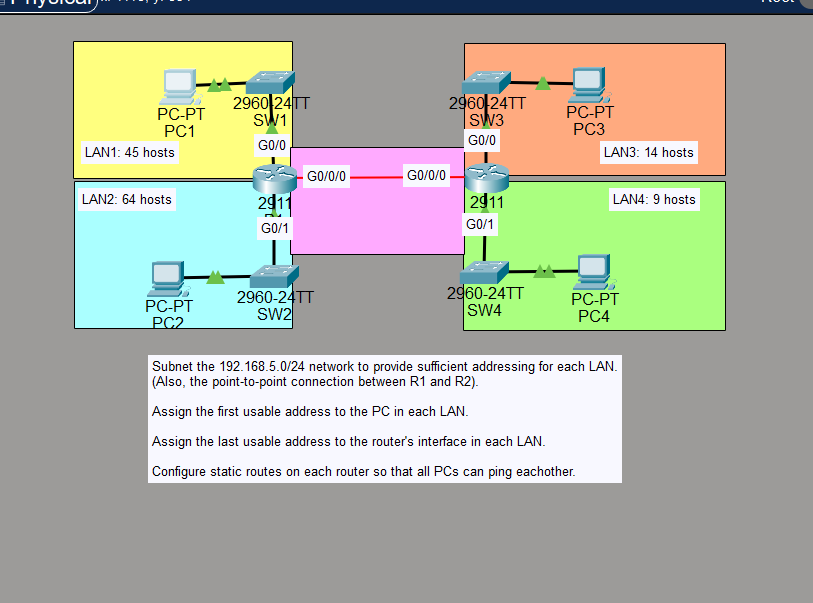

# Lab 02 – VLSM & Static Routing

**Base Network:** `192.168.5.0/24`  
**Tool:** Cisco Packet Tracer  
**Devices:** 2x Cisco 2911 Router, 4x Cisco 2960-24TT Switch, 4x PC  
**Topics:** VLSM, Subnetting, Static Routes, Inter-Router Communication

---

## Lab Objectives

- Subnet `192.168.5.0/24` using VLSM to provide sufficient addressing for each LAN and the point-to-point link between R1 and R2
- Assign the **first usable address** to the PC in each LAN
- Assign the **last usable address** to the router interface in each LAN
- Configure **static routes** on each router so all PCs can ping each other

---

## Topology



> R1 connects to LAN1 (45 hosts) via G0/0 and LAN2 (64 hosts) via G0/1.  
> R2 connects to LAN3 (14 hosts) via G0/0 and LAN4 (9 hosts) via G0/1.  
> R1 and R2 are linked via a point-to-point connection on G0/0/0.

---

## Section 1 – Subnet Allocation (VLSM)

Subnets allocated **largest to smallest** to avoid address space fragmentation:

| Subnet / LAN | Network Address | First Usable | Last Usable | Broadcast | Usable Hosts |
|---|---|---|---|---|---|
| LAN2 (64 hosts) | 192.168.5.0/25 | 192.168.5.1 | 192.168.5.126 | 192.168.5.127 | 126 |
| LAN1 (45 hosts) | 192.168.5.128/26 | 192.168.5.129 | 192.168.5.190 | 192.168.5.191 | 62 |
| LAN3 (14 hosts) | 192.168.5.192/28 | 192.168.5.193 | 192.168.5.206 | 192.168.5.207 | 14 |
| LAN4 (9 hosts) | 192.168.5.208/28 | 192.168.5.209 | 192.168.5.222 | 192.168.5.223 | 14 |
| P2P (R1 ↔ R2) | 192.168.5.224/30 | 192.168.5.225 | 192.168.5.226 | 192.168.5.227 | 2 |

---

## Section 2 – Router Interface Addressing

| Interface | IP / Mask | Role | Assignment Rule |
|---|---|---|---|
| R1 G0/0 | 192.168.5.190/26 | LAN1 Gateway | Last usable |
| R1 G0/1 | 192.168.5.126/25 | LAN2 Gateway | Last usable |
| R1 G0/0/0 | 192.168.5.225/30 | P2P R1 side | First usable |
| R2 G0/0 | 192.168.5.206/28 | LAN3 Gateway | Last usable |
| R2 G0/1 | 192.168.5.222/28 | LAN4 Gateway | Last usable |
| R2 G0/0/0 | 192.168.5.226/30 | P2P R2 side | Second usable |

---

## Section 3 – PC Addressing

| PC | LAN | IP / Mask | Default Gateway | Assignment Rule |
|---|---|---|---|---|
| PC1 | LAN1 | 192.168.5.129/26 | 192.168.5.190 | First usable |
| PC2 | LAN2 | 192.168.5.1/25 | 192.168.5.126 | First usable |
| PC3 | LAN3 | 192.168.5.193/28 | 192.168.5.206 | First usable |
| PC4 | LAN4 | 192.168.5.209/28 | 192.168.5.222 | First usable |

---

## Section 4 – Router Configurations

### R1 – Interface Configuration

```
R1> enable
R1# configure terminal

R1(config)# interface GigabitEthernet0/0
R1(config-if)# ip address 192.168.5.190 255.255.255.192
R1(config-if)# no shutdown
R1(config-if)# exit

R1(config)# interface GigabitEthernet0/1
R1(config-if)# ip address 192.168.5.126 255.255.255.128
R1(config-if)# no shutdown
R1(config-if)# exit

R1(config)# interface GigabitEthernet0/0/0
R1(config-if)# ip address 192.168.5.225 255.255.255.252
R1(config-if)# no shutdown
R1(config-if)# exit
```

### R1 – Static Routes

```
! Route to LAN3 via R2
R1(config)# ip route 192.168.5.192 255.255.255.240 192.168.5.226

! Route to LAN4 via R2
R1(config)# ip route 192.168.5.208 255.255.255.240 192.168.5.226

R1(config)# end
R1# write memory
```

### R2 – Interface Configuration

```
R2> enable
R2# configure terminal

R2(config)# interface GigabitEthernet0/0
R2(config-if)# ip address 192.168.5.206 255.255.255.240
R2(config-if)# no shutdown
R2(config-if)# exit

R2(config)# interface GigabitEthernet0/1
R2(config-if)# ip address 192.168.5.222 255.255.255.240
R2(config-if)# no shutdown
R2(config-if)# exit

R2(config)# interface GigabitEthernet0/0/0
R2(config-if)# ip address 192.168.5.226 255.255.255.252
R2(config-if)# no shutdown
R2(config-if)# exit
```

### R2 – Static Routes

```
! Route to LAN1 via R1
R2(config)# ip route 192.168.5.128 255.255.255.192 192.168.5.225

! Route to LAN2 via R1
R2(config)# ip route 192.168.5.0 255.255.255.128 192.168.5.225

R2(config)# end
R2# write memory
```

---

## Section 5 – Troubleshooting

### Problem: Static routes not showing in `show ip route`

| | Detail |
|---|---|
| **Symptom** | Static routes configured on R1 and R2 were not appearing in `show ip route` |
| **Root Cause** | `GigabitEthernet0/0/0` (the P2P link) was in **shutdown state** on both routers. IOS only installs a static route if the next-hop is reachable via an active interface |
| **Fix** | Ran `no shutdown` on G0/0/0 for both R1 and R2 — routes appeared immediately |

> **Key lesson:** Always run `show ip interface brief` first when troubleshooting routing issues. If the interface Status or Protocol column shows `down`, your static routes pointing through that interface will never be installed.

---

## Section 6 – Verification

### Commands Used

```
! Check all interfaces are up/up
R1# show ip interface brief
R2# show ip interface brief

! Confirm static routes are installed (look for 'S' entries)
R1# show ip route
R2# show ip route

! End-to-end ping test
PC1> ping 192.168.5.209
```

### Ping Result – PC1 to PC4


> First ping attempt showed 50% loss (normal — ARP resolution in progress).  
> Second attempt: **4/4 packets received, 0% loss** — full connectivity confirmed across all LANs.

---

## Key Concepts

**VLSM** – Allocating different-sized subnets from one address block based on actual host requirements. Always size from largest to smallest to prevent gaps in the address space.

**Static Routing** – Both directions must be configured. R1 needs routes for R2's LANs and R2 needs routes for R1's LANs. Missing one direction causes one-way traffic (ping requests go through but replies are dropped).

**Interface State** – A static route will not be installed in the routing table if its exit interface is down. Always bring interfaces up with `no shutdown` before expecting routes to appear.
